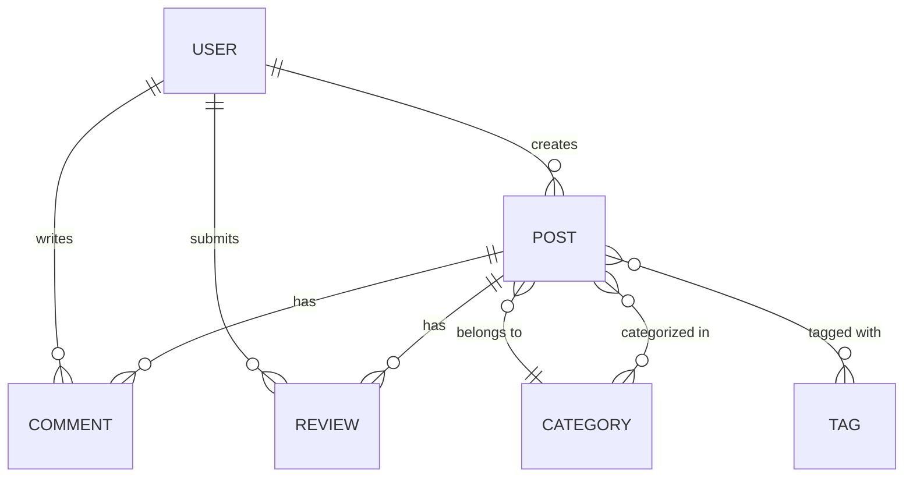
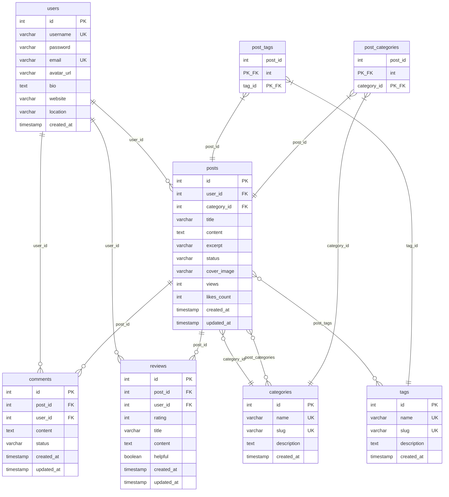
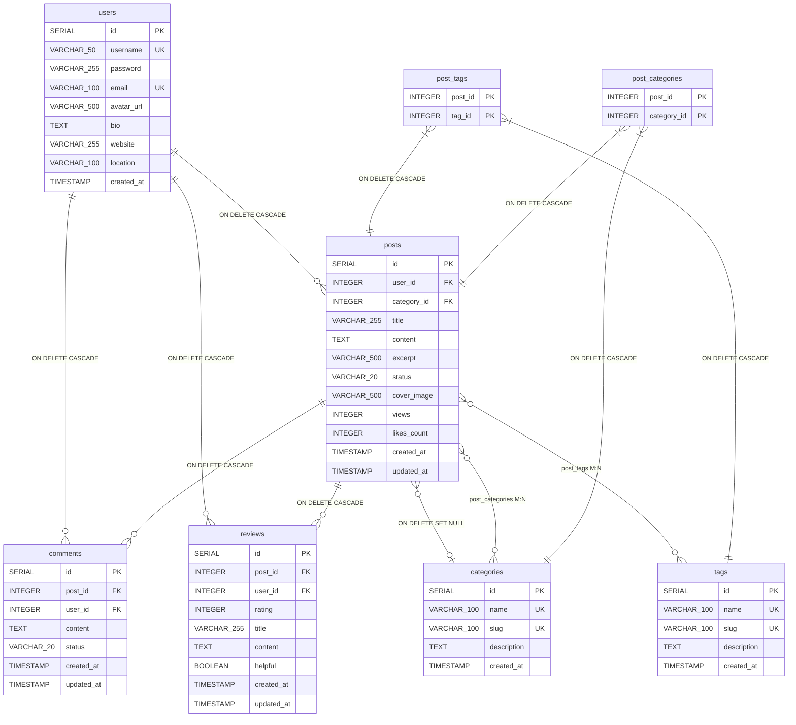

# Database Models - Java Blog Platform

This document contains the conceptual, logical, and physical database models for the Java Blog Platform using Mermaid diagrams.

## Table of Contents

- [Conceptual Model](#conceptual-model)
- [Logical Model](#logical-model)
- [Physical Model](#physical-model)
- [Key Design Highlights](#key-design-highlights)

---

## Conceptual Model

The conceptual model represents the high-level business entities and their relationships.



### Conceptual Model Features

- **Entities**: User, Post, Category, Tag, Comment, Review
- **Relationships**:
  - Users create Posts (1:N)
  - Users write Comments (1:N)
  - Users submit Reviews (1:N)
  - Posts have Comments (1:N)
  - Posts have Reviews (1:N)
  - Posts belong to a Category (N:1)
  - Posts are tagged with Tags (N:M)
  - Posts are categorized in Categories (N:M)

---

## Logical Model

The logical model shows the normalized database structure with primary keys, foreign keys, and data types.



### Logical Model Features

- **Normalization**: Third Normal Form (3NF)
- **Junction Tables**:
  - `post_tags` for Post-Tag many-to-many relationship
  - `post_categories` for Post-Category many-to-many relationship
- **Keys**:
  - PK = Primary Key
  - FK = Foreign Key
  - UK = Unique Key
- **Total Tables**: 8 (6 entity tables + 2 junction tables)

---

## Physical Model

The physical model represents the actual PostgreSQL database implementation with constraints, indexes, and triggers.



### Physical Model Features

#### Database Management System

- **DBMS**: PostgreSQL 17.2+
- **Architecture**: Hybrid (PostgreSQL + MongoDB for comments/reviews)

#### Indexes (25+ total)

- `idx_users_email`, `idx_users_username`
- `idx_posts_user_id`, `idx_posts_category_id`, `idx_posts_status`, `idx_posts_title`, `idx_posts_created_at`
- `idx_categories_name`, `idx_categories_slug`
- `idx_tags_name`, `idx_tags_slug`
- `idx_post_tags_post_id`, `idx_post_tags_tag_id`
- `idx_post_categories_post_id`, `idx_post_categories_category_id`
- `idx_comments_post_id`, `idx_comments_user_id`, `idx_comments_status`, `idx_comments_created_at`
- `idx_reviews_post_id`, `idx_reviews_user_id`, `idx_reviews_rating`, `idx_reviews_helpful`

#### Constraints

- **CHECK Constraints**:
  - Username minimum 3 characters
  - Email format validation (regex)
  - Category/Tag slug format (lowercase-hyphen)
  - Post status must be 'draft', 'published', or 'archived'
  - Views and likes_count must be >= 0
  - Comment content 1-5000 characters
  - Review rating must be 1-5
- **UNIQUE Constraints**:
  - One review per user per post
  - Unique usernames and emails
  - Unique category and tag names/slugs
- **NOT NULL Constraints**: Applied to required fields

#### Triggers

```sql
-- Auto-update updated_at timestamp
- update_posts_updated_at
- update_comments_updated_at
- update_reviews_updated_at
```

#### Cascade Rules

- **ON DELETE CASCADE**: Users → Posts, Comments, Reviews
- **ON DELETE CASCADE**: Posts → Comments, Reviews
- **ON DELETE SET NULL**: Categories → Posts
- **ON DELETE CASCADE**: Junction tables (post_tags, post_categories)

#### Database Views

```sql
-- Post statistics with aggregated data
CREATE VIEW post_statistics AS ...

-- Popular posts ranked by views and likes
CREATE VIEW popular_posts AS ...
```

---

## Key Design Highlights

### 1. Normalization

- **Third Normal Form (3NF)** compliance
- No redundant data
- Atomic values in all columns
- Proper use of foreign keys

### 2. Scalability

- **25+ indexes** for query optimization
- **Views** for complex queries (post_statistics, popular_posts)
- **Junction tables** for many-to-many relationships
- Proper data types sized for expected data

### 3. Data Integrity

- **Foreign key constraints** ensure referential integrity
- **CHECK constraints** validate data ranges and formats
- **UNIQUE constraints** prevent duplicates
- **NOT NULL constraints** on required fields
- **Triggers** automatically maintain timestamp consistency
