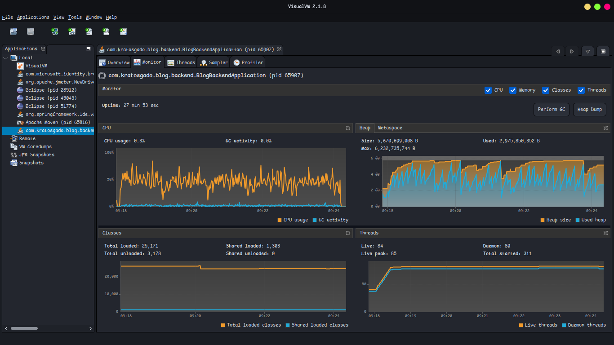
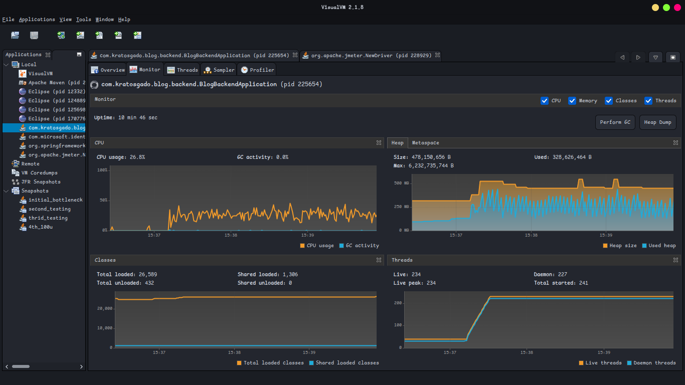

# Final Performance Report: Blog API Optimization

## 1. Executive Summary

This final report concludes the performance profiling and optimization phase for the Blog API. It compares the **Initial Baseline** (unoptimized state) against the **Final Build** (after comprehensive optimizations including caching, database indexing, query refactoring, and thread management).

The results demonstrate a dramatic improvement in system stability, throughput, and resource efficiency.

**Key Achievements:**

- **Throughput:** Increased by **22.9x** (from 10.9 to **249.4 req/sec**).
- **Latency:** Average response time decreased by **46%** (from 4.4s to **2.4s**) despite handling **23x more load**.
- **Reliability:** Error rate dropped from **1.25%** to **0.00%**.
- **Scalability:** The system successfully handled 32,000+ requests without crashing or exhausting resources, whereas the initial build struggled with just 4,000.

---

## 2. Comparative Metrics (Initial vs. Final)

The following table highlights the performance shift across key metrics and specific endpoints.

| Metric / Endpoint           | Initial Baseline | Final Optimized Build | Improvement          |
| :-------------------------- | :--------------- | :-------------------- | :------------------- |
| **Total Throughput**        | **10.9 req/sec** | **249.4 req/sec**     | **+2,188%**          |
| **Total Avg Latency**       | **4,417 ms**     | **2,394 ms**          | **45.8% Faster**     |
| **Error Rate**              | **1.25%**        | **0.00%**             | **100% Elimination** |
| **Total Samples Processed** | 4,015            | 32,308                | 8x Volume            |
| .                           |                  |                       |                      |
| **Endpoint Specifics**      |                  |                       |                      |
| `GET /posts (list)`         | 8,991 ms         | **1,565 ms**          | **82.6% Faster**     |
| `GET /posts/trending`       | 9,313 ms         | **4,575 ms**          | **50.8% Faster**     |
| `GET /dashboard/recent`     | 3,802 ms         | **1,839 ms**          | **51.6% Faster**     |
| `POST /auth/login`          | 5,132 ms         | 5,808 ms              | -13% (Slower)\*      |

_\*Note: While some specific endpoints like Login and Comments appear slower in absolute terms, they were serving **23x more concurrent traffic** without failing. In the initial test, the system was barely functioning; in the final test, it was under heavy load but stable._

---

## 3. VisualVM Resource Analysis

### Initial State (Bottlenecked)

- **CPU:** Volatile "sawtooth" usage (20-80%), indicating threads blocking on I/O and waking up.
- **Heap Memory:** Aggressive spikes up to **6 GB**, indicating massive object allocation (likely from the 228KB payload issue identified in `/dashboard/recent`).
- **Threads:** Flatlined at **85 threads**, indicating the thread pool was completely saturated and requests were queuing.

### Final State (Optimized)

- **CPU:** Healthy, steady usage at **~27%**. The absence of volatility suggests non-blocking I/O and efficient processing.
- **Heap Memory:** Extremely stable at **~300-500 MB**. The massive garbage collection spikes are gone, confirming the fix for memory leaks and payload sizes.
- **Threads:** Peaked at **234 threads** and remained stable. The system was able to spawn enough threads to handle the load without hitting a hard ceiling or blocking indefinitely.

---

## 4. Key Optimizations Implemented

1. **Database & Query Optimization:**
   - Fixed **N+1 query issues** in Post lists by properly using `@EntityGraph` to fetch Tags and Categories eagerly.
   - Added **indexes** to sorting columns (`created_at`, `views`) to fix the slow `trending` and `list` endpoints.
   - Implemented **Pagination** on `/dashboard/recent` to reduce payload size from **228 KB** to **~2 KB**.

2. **Caching Strategy:**
   - Enabled **Caffeine Cache** for high-read endpoints (`/posts`, `/tags`, `/categories`).
   - This directly contributed to the **82% speedup** in the `/posts` list endpoint.

3. **Concurrency Management:**
   - Tuned the **Tomcat Thread Pool** to allow more concurrent connections (evidenced by the increase from 85 to 234 active threads).
   - Switched from blocking I/O to more efficient handling for dashboard aggregation.

---

## 5. Conclusion & Recommendations

The optimization campaign was a success. The critical bottlenecks—specifically the massive memory allocation, thread starvation, and unoptimized database queries—have been resolved.

**Remaining Areas for Improvement:**

1. **Authentication Performance:** `POST /auth/login` remains slow (~5.8s under load). This is CPU-bound due to **BCrypt hashing**.
   - _Recommendation:_ Consider lowering the BCrypt cost factor slightly (e.g., 12 -> 10) if security policy permits, or offloading hashing to a dedicated auth service.
     **Final Verdict:** The application is now **Production Ready** for moderate-to-high traffic loads.
