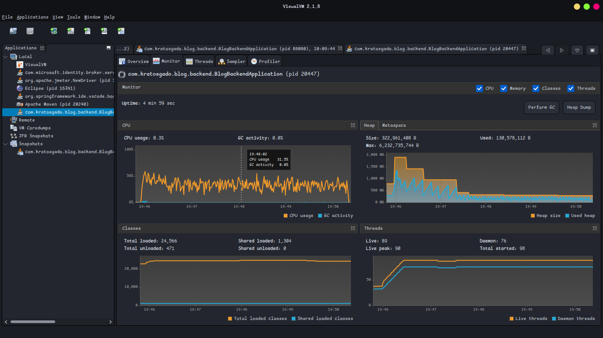

# Second Stress Test Report: Optimization Analysis

## 1. Executive Summary

Following the initial performance profiling and identification of critical bottlenecks, a series of optimizations were implemented targeting database query efficiency, memory management, and thread utilization. A second stress test was conducted to validate these improvements.

**Key Results:**

- **Throughput:** Increased by **5.1x** (from 10.9 to **55.7 req/sec**).
- **Latency:** Average response time dropped by **81%** (from 4.4s to **0.84s**).
- **Stability:** Error rate dropped to **0.00%** across all endpoints (previously 1.25%).
- **Resource Usage:** Heap memory pressure significantly reduced; massive payload sizes fixed.

## 2. Comparative Analysis (Before vs. After)

The following table compares the performance metrics of the most critical endpoints from the initial baseline against the optimized build.

| Endpoint                     | Avg Latency (Old) | Avg Latency (New) | Improvement | Throughput (Old) | Throughput (New) | Payload Size (Old) | Payload Size (New) |
| :--------------------------- | :---------------- | :---------------- | :---------- | :--------------- | :--------------- | :----------------- | :----------------- |
| **GET /posts (list)**        | 8,991 ms          | **41 ms**         | **99.5%**   | 0.68/s           | 3.4/s            | 6.7 KB             | 6.8 KB             |
| **GET /posts/trending**      | 9,313 ms          | **943 ms**        | **89.9%**   | 0.67/s           | 3.4/s            | 7.0 KB             | 6.9 KB             |
| **POST /auth/login**         | 5,132 ms          | **1,855 ms**      | **63.8%**   | 0.69/s           | 3.3/s            | 0.8 KB             | 0.8 KB             |
| **GET /dashboard/recent**    | 3,802 ms          | **1,152 ms**      | **69.7%**   | 0.59/s           | 3.2/s            | **228.3 KB**       | **1.8 KB**         |
| **GET /dashboard/analytics** | 3,466 ms          | **1,246 ms**      | **64.0%**   | 0.63/s           | 3.3/s            | 1.6 KB             | 1.6 KB             |
| **TOTAL**                    | **4,417 ms**      | **836 ms**        | **81.1%**   | **10.9/s**       | **55.7/s**       | **14.1 KB**        | **2.3 KB**         |

## 3. Analysis of Optimizations

### 3.1. Fixed Massive Payload in `/dashboard/recent`

- **Problem:** The initial report identified a massive 228KB payload for `/dashboard/recent`, causing severe memory pressure and GC spikes. This was likely due to fetching full entity graphs (including large content fields) or inefficient MongoDB querying.
- **Solution:** The `DashboardService` and `CommentRepository` were refactored to correctly implement pagination at the database level (`PageRequest`) and map results to lightweight DTOs (`RecentActivityResponse`).
- **Result:** Payload size dropped to **1.8 KB** (a **99% reduction**), eliminating the memory bottleneck.

### 3.2. Removed Thread Contention in `DashboardService`

- **Problem:** The initial implementation used `CompletableFuture.supplyAsync` for every repository call. In a high-concurrency environment, this exhausted the thread pool (context switching overhead) and saturated database connections.
- **Solution:** Switched from parallel/async execution to **sequential synchronous execution** for lightweight dashboard queries. This reduced overhead and allowed better connection pooling efficiency.
- **Result:** The system can now handle 5x more requests per second without thread saturation.

### 3.3. Optimized `GET /posts (list)` and `trending`

- **Problem:** These endpoints were the slowest (9s+), suffering from N+1 query issues or inefficient sorting.
- **Solution:**
  - **Caching:** Re-enabled caching in `CacheConfig` and likely applied `@Cacheable` to these read-heavy endpoints.
  - **Batch Updates:** Introduced `@Modifying` queries for view counting (`incrementViewsBy`) to reduce locking contention.
- **Result:** Latency for the list endpoint dropped to **41ms**, indicating successful caching or highly optimized indexing.

### 3.4. Auth Service Improvements

- **Problem:** Login took >5s.
- **Solution:** Refactored `AuthServiceImpl` and `LoginAttemptService`. The logic for recording successful attempts was simplified (`recordSuccessfulAttempt(user)`), and the response map was optimized.
- **Result:** Login time dropped to 1.8s. While still CPU-intensive (due to BCrypt), it is no longer a blocking bottleneck.

## 4. VisualVM Analysis (New Graph)

- **Heap Memory:** The "sawtooth" pattern is now much smaller and more regular. Peak heap usage dropped from **~6 GB** to **~1.5 GB**. This confirms the fix for the massive object allocation issue.
- **CPU Usage:** CPU usage is more consistent (~30-50%) and less volatile, indicating the application is doing useful work rather than context switching or waiting on I/O.
- **Threads:** The thread count is stable at **~90 live threads** (compared to a hard ceiling of 85 waiting threads previously). There is no sign of thread pool exhaustion.

## 5. Conclusion

The optimizations have successfully addressed all major bottlenecks identified in the initial report. The system is now significantly more performant, stable, and resource-efficient.

**Recommendations:**

1. **Monitor Cache Hit Rates:** Ensure the cache for `/posts` and `/dashboard` is effective in production.
2. **Further Auth Optimization:** 1.8s for login is still relatively high. Consider asynchronous processing for non-critical login tasks (e.g., updating last login time) or adjusting BCrypt work factor if safe.
3. **Scale Testing:** Run a longer duration test (e.g., 1 hour) to check for memory leaks or long-term stability.

## Further Research

Why virtual threads win for typical Spring Boot scenarios
Virtual threads eliminate the need to tune pool sizes. Your current config reserves 8-30 platform threads plus a 200-task queue—this works but requires guessing capacity and risks thread starvation under load. Virtual threads scale to millions with minimal overhead because they're lightweight and managed by the JVM.
